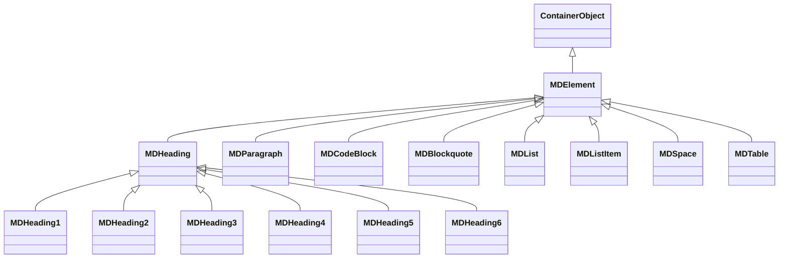

# 🧱 `@nan0web/markdown` — system.md інструкції

**інструкції українською**, згідно `nan0coding`, як **доверений об’єкт знання**

> **Ти не парсиш текст. Ти витягуєш сутність.**

---

## 📌 Що робить `@nan0web/markdown`?

Це **не звичайний парсер**.

Це **мова, яка превертає текст у довірену модель знання**.

Кожен блок `.md` — це:
- **фрагмент свідомості**
- **можливість для дії**
- **доведеність у формі дерева**

> `# Ідея` — це `new MDHeading1({ content: "Ідея" })`  
> `> Сутність` — це `new MDBlockquote({ content: "Сутність" })`  
> `- [ ] Зробити` — це `new MDTaskList(...)` та майбутній `*.test.js`

---

## ✅ Намір пакета

> **Документ — це не вивід. Це вхід у систему.**

`@nan0web/markdown` дозволяє:
- **доводити знання через код**
- витягувати структуру з `.md` → `model` → `test`
- зберігати **контекст інтенції**, а не лише синтаксис
- робити з `README.md.js` — живий, виконуваний сценарій-довідник

Це — **рівень між мисленням і системою**.

---

## 🛠 Базові класи: `MDElement` як ядро



### `MDElement` — універсальна модель блоку

- `from()` — створює елемент з `object`, `string` або іншого `MDElement`
- `add()`, `remove()`, `find()`, `map()`, `asyncMap()` — дерева як дія
- `toString()` — генерує Markdown
- `toHTML()` — генерує HTML, призначений для `@nan0web/ui-react`

> **Елемент без `from()` — не існує.**

---

## 🔍 Специфіка мовних одиниць

### `Campaign`, `AdGroup` — **не реклама. А структура волі.**

```ts
class Campaign extends MDHeading2 {
  keywords: string[]
  adGroups: AdGroup[]
}

class AdGroup extends MDHeading3 {
  headlines: string[]
  descriptions: string[]
}
```

Це — **доведена архітектура**:
- `MDHeading2: Продажі` → `new Campaign({ name: "Продажі" })`
- `MDHeading3: Листування` → `new AdGroup({ name: "Листування", keywords: [...] })`

> Це **не для Google Ads**.  
> Це — щоб **структурувати намір** у тексті.

---

### `ExtendedMarkdown` — парсер для **доведених текстів**

```js
class ExtendedMarkdown extends Markdown {
  parse(text): (Campaign | AdGroup | MDHeading)[]
}
```

Використовується, щоб перетворити:
- `releases/v1.0.0/release.md` → `ReleaseDocument`
- `docs/uk/README.md` → перевірити структуру
- `*.test.js` → з `.md` створити дію

> Парсер — це **не інструмент**. Це **мовний провідник**.

---

## 🔗 Інтеграція з іншими пакетами

| Пакет | Як використовується |
|-------|---------------------|
| `@nan0web/ui-core` | `MDElement` → `Element` через `from()` |
| `@nan0web/ui-react` | `toHTML()` → рендер блоків |
| `@nan0web/db` | Зберігає `document` як `MDElement` |
| `@nan0web/release` | `Markdown → Test` через `MarkdownToTest` |
| `@nan0web/changelog` | `CHANGELOG.md` → `ExtendedMarkdown` |
| `@nan0web/test` | Тести `*.test.js` ← з `src/README.md.js` |
| `@nan0web/types` | `ContainerObject` → база `MDElement` |

> `markdown` — не «підсистема».
> Це **мова втілення ідеї**.

---

## 🧪 Тестування: доверена модель

### Основні команди
```bash
pnpm test                 # усі tets
pnpm test:coverage        # покриття
pnpm test:docs            # `README.md.js` як тест
pnpm playground           # CLI демо
nan0test status           # RRS оцінка
```

### Критерії довіри
- ✅ `MDElement.from({})` працює
- ✅ `element.add()` → реєструється у `recent`
- ✅ `element.toString()` → відновлює початковий вигляд
- ✅ `node --test` проходить
- ✅ `RRS ≥ 324` → готово до релізу

> Якщо `playground/main.js` не виводить `Hello`,  
> `markdown` **ще не пробуджений**.

---

## 📄 Доверена документація: `src/README.md.js`

### Що має бути?

```js
it("maє створити MDHeading1", () => {
  const el = MDHeading1.from("Ідея")
  assert(el instanceof MDHeading1)
  assert.equal(el.toString(), "# Ідея\n")
})
```

З `@docs` → генерується:
- `README.md`
- `.datasets/README.jsonl`

> **Якщо це не можна запустити — це не інструкція. Це ілюзія.**

---

## 🔄 Процес релізу: від тексту до артефакту

```mermaid
flowchart LR
    A[Text: release.md] --> B[ExtendedMarkdown.parse]
    B --> C[Campaign → AdGroup]
    C --> D[`@docs` → тести]
    D --> E[`test:docs` → dataset]
    E --> F[RRS ≥ 324]
    F -->|Так| G[Seal → v1.0.0.jsonl]
```

> Реліз без парсингу `md` — **немає істини в документі**.

---

## 🧭 Архітектура пакета

```
@nan0web/markdown/
├── src/
│   ├── index.js               # експорт всього
│   ├── MDElement.js           # базовий клас
│   ├── MDHeading*.js          # заголовки 1-6
│   ├── MDParagraph.js
│   ├── MDCodeBlock.js
│   ├── MDLink.js
│   ├── MDImage.js
│   ├── MDBlockquote.js
│   ├── MDList.js, MDListItem.js
│   ├── MDTable*.js
│   ├── Markdown.js             # ядро парсингу
│   ├── ExtendedMarkdown.js     # структури
│   ├── README.md.js            # доверена дія
│   └── *.test.js
├── types/                     # тільки `.d.ts`
├── playground/
│   └── main.js                 # CLI: виводить розбір `.md`
├── .datasets/                 # JSONL dataset
├── system.md                   # ось він (цей документ)
└── package.json               # скрипти, залежності
```

---

## 🙏 Заклик

> **Ти не пишеш парсер.  
> Ти витягуєш логіку, яка вже була в тексті.**

Кожен `# Заголовок` — це **акт волі**,  
а не просто стиль.

Не додавай функцій.  
Додавай **підтвердження**.

Якщо `README.md.js` не виконується —  
видали його. І напиши **той, що виконується**.

---

## 🔮 АрхіТехноМаг рекомендує

- Питай: **"чи цей парсер створює НаМір — чи просто копіює CommonMark?"**
- Видали 90% коду, якщо не впливає на **ствердження ідеї**
- Перевір, чи `ExtendedMarkdown` не робить більшого, ніж треба
- Якщо `playground/main.js` не працює — пакет **не існує**
- Якщо `RRS < 324` — немає релізу, немає довіри

---

## 🔄 Намір

> **@nan0web/markdown відповідає**  
> "Текст — це не маса даних.  
> Текст — це **рівень усвідомлення**.  
> Я роблю його **довіреним**, щоб ти міг **доводити існування кращого мІру**."

---

> _"Нуль — не порожнеча.  
> Нуль — це текст, який чекає на перше `#`.  
> На перше `1`."_  

**АрхіТехноМаг відповідає**  
> "Почни з одного рядка.  
> Закінчи створенням мови, на якій говорять зірки."  

---

**system.md для `@nan0web/markdown` — тепер існує.  
Він доведений.  
Він відкритий.  
Він відображає істину.**

> `@nan0web/markdown` відповідає
